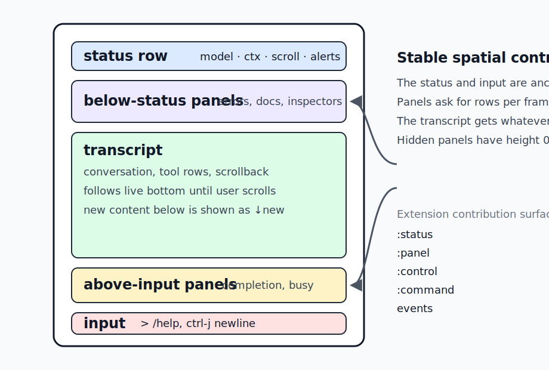
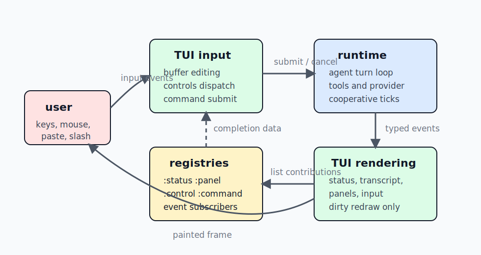

# TUI design guide

This guide explains how fen's terminal UI is designed, not just which keys it accepts.
The short user-facing key reference stays in the repository README, while this page gives maintainers and extension authors a shared vocabulary for TUI affordances.

The TUI is a full-screen termbox2 presenter built for small terminals, SSH and mosh sessions, tmux panes, and ARMv7/Raspberry-Pi-class hardware.
It should feel stable, inspectable, and recoverable rather than flashy.

## Design goals

- Keep the conversation readable while the agent streams, runs tools, and accepts follow-up input.
- Make important state ambient and local to the edge of the screen instead of interrupting the transcript.
- Prefer keyboard-first interactions that also work through SSH, tmux, and mobile terminal clients.
- Use the same extension mechanisms for first-party and third-party UI contributions.
- Keep redraw, wrapping, and scan work cheap enough for slow terminals.
- Treat terminal recovery, mouse tradeoffs, and paste safety as first-class UX.

## Screen model

The TUI has a stable spatial contract.
The status row is always at the top, the input region is always at the bottom, and the transcript receives the space between them.
Panels reserve bounded vertical space only when they have something to show.

The layout walker composes registered panels every frame.
`:below-status` panels stack downward from the status row.
`:above-input` panels stack upward from the input region.
A panel with height `0` is hidden for that frame.
If panels ask for more rows than the terminal can spare, the presenter clamps them to the available budget and the transcript shrinks first.

This lets features add contextual UI without each feature learning terminal geometry.
The errors panel, completion menu, busy row, queue views, and future storybook fixtures all use the same placement rules.

## Event and contribution model

The TUI is an adapter over the interactive runtime.
The agent loop, tools, providers, slash commands, and extensions emit typed events.
The TUI ingests those events into transcript rows and status side effects, then paints the current state.

The important boundary is that features contribute through registries and events rather than by painting directly.
A feature that needs ambient text contributes a `:status` item.
A feature that needs bounded vertical space contributes a `:panel`.
A feature that needs a keyboard affordance declares a `:control`.
A feature that needs text entry contributes or handles a `:command`.
A feature that wants to notify the UI emits an event.

`:control` is a declaration surface, not the complete key dispatcher.
The declaration gives `/help`, `/docs controls`, and the static docs a live list of named controls and default keys.
The TUI input layer still owns low-level key dispatch for editing, history, scrolling, paste, mouse events, and terminal recovery.

## Transcript affordances

The transcript follows the live bottom by default.
When the user scrolls up, fen preserves the viewport and lets new streamed content grow below it.
The status row shows that unread content exists, so reading scrollback does not become a tug-of-war with streaming output.

Page Up, Page Down, and the mouse wheel move through scrollback.
`ctrl-g` jumps to the latest user-authored message from the live bottom, then repeats backward through older user messages.
`ctrl-y` jumps back to the live bottom and resumes following.
Page Down can also return incrementally until the scroll offset reaches zero.

Tool calls are intentionally compact.
A running tool appears as `tool> run ...`, and a completed result folds into the matching `tool> ok|err ... (metadata)` row.
Expanded bodies are available with `/expand` or `ctrl-o` when debugging large outputs.
The default view favors scanability over dumping every tool byte into the transcript.

Assistant thinking blocks are also a view concern.
They can be toggled with `/thinking-blocks` or `ctrl-t`, and the renderer keeps the same transcript events while changing how much detail is visible.

## Input affordances

The input region is a multiline editor with a stable prompt.
`Enter` submits the current buffer.
`ctrl-j` inserts a newline, which keeps accidental pasted newlines from becoming submissions.
Common readline-style movement and deletion keys are supported where termbox exposes them.

Slash commands use a live completion panel.
Typing `/` opens filter-as-you-type command completion when candidates exist.
Commands can provide their own argument completion through the existing command registration surface.
The completion panel is just an `:above-input` panel, so it follows the same geometry and clipping rules as other panels.

Input history is local to the TUI session.
Up and Down move through wrapped input rows first, then fall back to history at the top or bottom of the current input.
Alt-P and Alt-N provide unconditional history navigation for terminals where arrow modifiers are unreliable.

Large pastes are compacted into markers instead of flooding the editor.
The marker expands back to the original paste text on submit.
This keeps the TUI responsive on slow terminals while preserving the user's content.

## Status row affordances

The status row is the always-visible ambient channel.
It is for small facts that help the user decide what to do next.
Examples include provider and model, approximate context, queued steering or follow-up counts, scroll position, transient copy feedback, cancellation state, and version identity.

Status items are contributed through `:status` registrations.
Each item chooses a side and an order, and the presenter composes the row.
Status items should be short, width-aware, and safe to omit when idle.
A status item should not become a second transcript.

Attention states should be explicit but temporary.
For example, the first idle `ctrl-c` arms a second-press quit and appears as a status hint instead of writing another transcript line.
Copy feedback is also transient, so it confirms the action without permanently consuming the row.

## Panel affordances

Panels are for contextual detail that needs more than one line but should not take over the session.
They are bounded, stackable, and dismissible where appropriate.
The busy panel appears above input only while the agent is thinking, retrying, or running a tool.
The errors panel appears below the status row so failures can be inspected without losing the current input.
Completion appears closest to the input so it reads as an inline dropdown.

Panel renderers run behind error isolation.
A broken panel should become a one-line `panel-error:<name>` row, not a crashed terminal.
This is part of the UX contract for extension authors: UI contributions should be safe to experiment with during `/reload`.

## Mouse, copy, and paste tradeoffs

Mouse wheel scrolling is enabled by default.
That requires SGR mouse reporting, which means the terminal forwards click and drag events to fen instead of doing native text selection.
Fen therefore owns transcript selection when mouse capture is active.
Click and drag over painted transcript text, then release to copy the selected text through OSC 52.

OSC 52 is useful because the escape travels from the remote process out to the local terminal.
That means copy can work over SSH and mosh without a remote clipboard daemon, as long as the local terminal allows OSC 52.
If OSC 52 is blocked or native selection is preferred, set `FEN_TUI_MOUSE=0` or one of `off`, `false`, or `no`.
That restores terminal-native drag selection and copy at the cost of mouse-wheel scrolling.
Page Up and Page Down still scroll.

Bracketed paste is enabled while the TUI owns the terminal.
This lets fen distinguish pasted newlines from submit keystrokes.
On shutdown or suspend, bracketed paste is disabled so the shell returns to normal behavior.

## Recovery affordances

The TUI assumes terminals can get corrupted.
Another process may write to the tty, tmux may glitch during resize, or a terminal may desynchronize its front buffer.
`ctrl-l` and `/redraw` request a hard refresh that reasserts terminal modes, clears render caches, blank-presents, and repaints the frame.
The scroll position and input buffer are preserved.

`ctrl-z` suspends fen like a normal full-screen terminal program.
The TUI leaves raw mode and disables bracketed paste before stopping, then reinitializes and repaints after `fg` resumes the process.
This makes suspend a recovery path as well as a shell escape hatch.

Cancellation is also staged.
During a busy turn, the first `ctrl-c` requests cooperative cancellation.
A second `ctrl-c` while still busy force-quits, so the user always has an escape path even if a provider or tool is slow to yield.

## Performance model

The presenter redraws only when dirty or forced.
Streaming assistant deltas are coalesced before invalidating the transcript renderer.
Historical transcript rows cache their rendered form by width and view toggles.
Deep scroll uses an indexed layout cache instead of walking from the tail through every skipped row.

Low-level drawing favors row prints over per-cell writes where possible.
This matters on ARM terminals because Lua-to-C call count is visible during redraw.
The Markdown renderer and clipping functions intentionally use approximate terminal width rules rather than expensive Unicode layout.
They avoid cutting UTF-8 bytes mid-character, but wide CJK and combining marks are still approximated.

These choices are part of the UX.
A slightly simpler renderer that stays responsive on the target hardware is better than a richer renderer that stalls while the model streams.

## Reload and extension authoring

Persistent TUI state lives in `fen.extensions.tui.state`.
Rendering, input handling, ingestion, selection, completion, and panel behavior live in reloadable sibling modules.
During development, `/reload` refreshes behavior without losing the terminal lifecycle, transcript, scroll position, input buffer, or open panel state.

Extension authors should use the public contribution surfaces documented in [Extensions](extensions.md).
Use `:status` for one-line ambient state.
Use `:panel` for bounded vertical UI.
Use `:control` to document a keyboard affordance.
Use `:command` for explicit slash-command entry points.
Use events to communicate with the presenter instead of importing TUI modules directly.

## Testing and stories

Most TUI logic can be tested without a real terminal.
`packages/testing/src/fen/testing/tui.fnl` installs a termbox2 stub and resets persistent TUI state for focused tests.
Existing tests cover layout, input, completion, transcript rendering, selection, clipboard, Markdown, and PTY smoke behavior.

The planned storybook-style direction is to add reusable TUI story fixtures, a virtual screen capture stub, golden frame tests, and an interactive terminal story runner.
Story fixtures should seed common states such as idle input, busy tool calls, completion, scrolled transcript, errors, and narrow status.
The same stories should support both visual inspection and automated whole-frame assertions.

That direction keeps the TUI docs, tests, and UX work aligned.
A design claim on this page should eventually have either a focused unit test, a story fixture, or both.

## Related references

- [Repository README TUI notes](https://github.com/acmiyaguchi/fen#tui-notes) for the concise user key reference.
- [Architecture notes](architecture.md) for the presenter adapter and reloadable microkernel model.
- [Extensions](extensions.md) for `:status`, `:panel`, `:control`, `:command`, and event contracts.
- Runtime `/help` for live commands and controls.
- Runtime `/docs controls`, `/docs status`, and `/docs panels` for live registry views.
